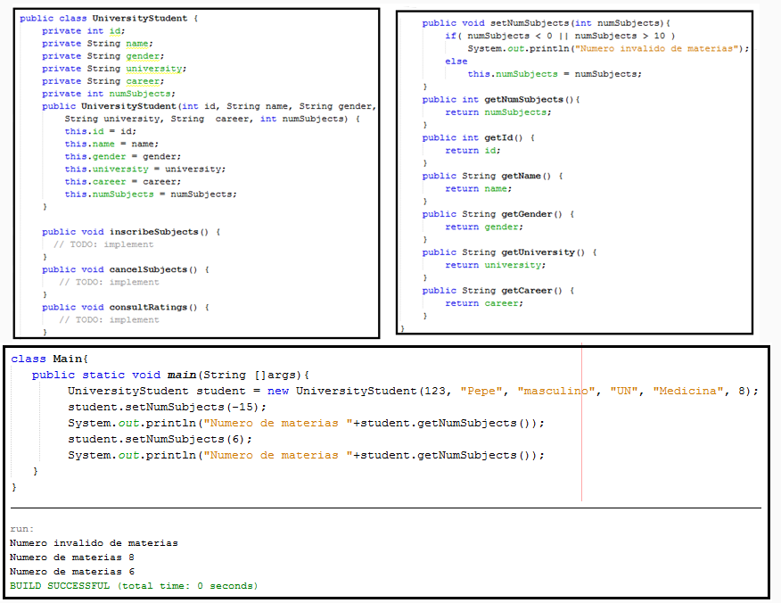
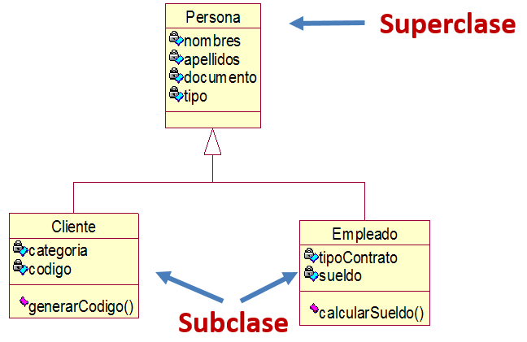
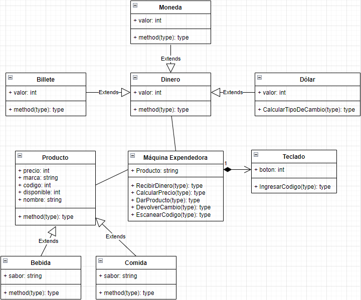

# Investigación Unidad 1

>## **El paradigma OO**

### **Definición de paradigma**

Un paradigma de programación es una manera o estilo de programación de software. Existen diferentes formas de diseñar un lenguaje de programación y varios modos de trabajar para obtener los resultados que necesitan los programadores.  Se trata de un conjunto de métodos sistemáticos aplicables en todos los niveles del diseño de programas para resolver problemas computacionales.

### **Definición de Programación Orientada a Objetos**

La Programación Orientada a Objetos (POO) es un paradigma de programación, es decir, un modelo o un estilo de programación que nos da unas guías sobre cómo trabajar con él. Se basa en el concepto de clases y objetos. Este tipo de programación se utiliza para estructurar un programa de software en piezas simples y reutilizables de planos de código (clases) para crear instancias individuales de objetos. 

*¿Cuál fue el primer lenguaje orientado a objetos, quienes y en dónde lo propusieron?**

Simula, en 1962, propuesto en Noruega por Quisten Negar y Ole-Johan Del. Las nociones básicas de la POO como las clases, la herencia, los métodos virtuales, etc., fueron creados en este lenguaje para permitir modelizar de manera fidedigna procesos industriales complejos. Simula-67 había abierto la vía de los lenguajes orientados a objetos, como Smalltalk y más adelante C++, Java y C# entre otros, que explotarían estos conceptos algunas décadas más tarde. Los dos autores de Simula fueron recompensados por sus trabajos a comienzos de los años 2000, es decir, justo antes de su desaparición. 

### **Concepto de abstracción**

La abstracción en programación consiste en enfatizar las características y funcionalidades únicas de un elemento, son representados como métodos y atributos en su respectiva clase. Es un proceso un tanto subjetivo debido a que el propio autor decide qué información es o no relevante.

*¿Por qué se considera fundamental en programación?*

Ayuda a evitar replicar código y de esta forma la complejidad del código se reduce, lo que es bastante útil para que sea más comprensible.

### **Concepto de encapsulamiento**

La encapsulación es un mecanismo para reunir datos y métodos dentro de una estructura ocultando la implementación del objeto, es decir, impidiendo el acceso a los datos por cualquier medio que no sean los servicios propuestos. A continuación hay 2 imágenes que ayudan a ilustrar el concepto:

Este es un sistema **con** encapsulamiento

 

Este es un sistema **sin** encapsulamiento

*¿Por qué es importante y qué problemas puede evitar?*

El encapsulamiento es importante porque oculta su interior protegiendo su integridad. Previene que desde fuera se pueda manipular el estado del objeto. Si no se restringe el acceso podría dejar al objeto en un estado inválido o inconsistente. También es útil para reducir la complejidad. Una clase debe tener una interfaz pública mínima para su manipulación. Si vamos a usar una clase en la que no se ha restringido de forma eficiente el acceso a sus miembros podemos encontrarnos con un exceso de funcionalidad irrelevante para nosotros, o peor aún, una puerta abierta a miembros que no debería acceder por riesgo a modificar el estado de la clase sin ningún criterio.

### **Concepto de herencia**

La herencia es informática es básicamente cuando existe una clase principal, con sus propias funciones y métodos, la cual tendrá sus propias subclases que heredarán los atributos de la clase principal, además de que también pueden tener sus propios atributos. Algo así como una clase "padre" y clases "hijos". La imagen que se muestra a continuación ayuda a ilustrar lo que quiero explicar. 

*Tanto los clientes como los empleados tienen todos los atributos que se muestran en la clase "Persona", además, dichas subclases poseen sus propios atributos.*

> ## **UML: Diagrama de clases**

El lenguaje UML comenzó a gestarse en octubre de 1994, cuando Rumbaugh se unió a lacompañía Rational fundada por Booch (dos reputados investigadores en el área de metodologíadel software). El objetivo de ambos era unificar dos métodos que habían desarrollado: el método Booch y el OMT (Object Modelling Tool). El primer borrador apareció en octubre de 1995. En esa misma época otro reputado investigador, Jacobson, se unió a Rational y se incluyeron ideas suyas. Además, este lenguaje se abrió a la colaboración de otras empresas para que aportaran sus ideas. Todas estas colaboraciones condujeron a la definición de la primera versión de UML. Esta primera versión se ofreció a un grupo de trabajo para convertirlo en 1997 en un estándar del OMG (Object Management Group). Este grupo, que gestiona estándares relacionados con la tecnología orientada a objetos, propuso una serie de modificaciones y una nueva versión de UML, que fue adoptada por el OMG como estándar en noviembre de 1997. Desde aquella versión ha habido varias revisiones que gestiona la OMG Revision Task Force. La última versión aprobada es la 1.4. En estos momentos se está desarrollando una nueva versión en la que se incluirán cambios importantes que conducirán a la versión 2.0 planificada para fines del 2002.

El Lenguaje Unificado de Modelado (UML) fue creado para forjar un lenguaje de modelado visual común y semántica y sintácticamente rico para la arquitectura, el diseño y la implementación de sistemas de software complejos, tanto en estructura como en comportamiento. UML tiene aplicaciones más allá del desarrollo de software, por ejemplo, en el flujo de procesos en la fabricación. Es comparable a los planos usados en otros campos y consiste en diferentes tipos de diagramas. En general, los diagramas UML describen los límites, la estructura y el comportamiento del sistema y los objetos que contiene.

El UML actualmente es probablemente el lenguaje más utilizado aún después de 20 años, es el estándar de modelado por excelencia. 

No puedo mencionar a alguna empresa local que utilice este lenguaje de modelado, pero seguro que más de una lo utiliza. 

### **Herramientas para el modelado en UML**

*GitMind*: 	Online Mind Map Tool

*Gliffy*: Software de gráficos basado en web

*MagicDraw*: Software propietario con licencia (Single, Floating, Mobile)

*Lucidchart*: Software de gráficos basado en web

*IBM Rational Rhapsody*: Entorno de desarrollo gráfico para el desarrollo y validación de software basado en modelos

*Microsoft Visio*: 	Software propietario de gráficos vectoriales y gráficos

## **Propuesta de máquina expendedora con UML**

Un diagrama UML de una máquina expendedora que hice sin tener mucha idea de diagramas UML.

# Referencias

[https://profile.es/blog/que-son-los-paradigmas-de-programacion/](https://profile.es/blog/que-son-los-paradigmas-de-programacion/)

[https://profile.es/blog/que-es-la-programacion-orientada-a-objetos/](https://profile.es/blog/que-es-la-programacion-orientada-a-objetos/)

[https://www.ediciones-eni.com/open/mediabook.aspx?idR=dbba30cf4ffac2993c1495a629f282df](https://www.ediciones-eni.com/open/mediabook.aspx?idR=dbba30cf4ffac2993c1495a629f282df)

[https://ifgeekthen.nttdata.com/es/herencia-en-programacion-orientada-objetos](https://ifgeekthen.nttdata.com/es/herencia-en-programacion-orientada-objetos)

[https://www.studocu.com/es-mx/document/universidad-mexicana-sc/diseno-de-sistemas/historia-de-uml/28989354](https://www.studocu.com/es-mx/document/universidad-mexicana-sc/diseno-de-sistemas/historia-de-uml/28989354)

[https://styde.net/encapsulamiento-en-la-programacion-orientada-a-objetos/](https://styde.net/encapsulamiento-en-la-programacion-orientada-a-objetos/)

[http://codigo418.blogspot.com/2017/10/la-importancia-del-encapsulamiento.html](http://codigo418.blogspot.com/2017/10/la-importancia-del-encapsulamiento.html)

[https://datascientest.com/es/encapsulacion-definicion-e-importancia](https://datascientest.com/es/encapsulacion-definicion-e-importancia)

[https://developer.mozilla.org/es/docs/Glossary/Abstraction](https://developer.mozilla.org/es/docs/Glossary/Abstraction)

[https://styde.net/abstraccion-programacion-orientada-a-objetos/](https://styde.net/abstraccion-programacion-orientada-a-objetos/)